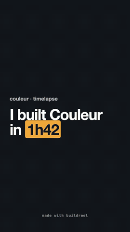

# Buildreel

**Ta session Claude Code, montée en vidéo build in public de 30 secondes.**

Buildreel est un mod pour [Claude Code](https://claude.com/claude-code). Pendant que tu construis, il note les moments qui comptent (fichiers écrits, tests qui passent du rouge au vert, commits) et filme ton app qui prend forme. À la fin, `/reel` ouvre une table de montage dans le terminal. Le Claude de ta session, qui sait ce qui a compté, choisit les plans et écrit des textes qu'un spectateur comprend. Tu gardes le dernier mot sur chaque plan, puis il monte une vidéo verticale et le texte du post pour X.

Rien ne quitte ta machine tant que tu ne postes pas toi-même.

<p align="center"></p>

## Installer

Dans Claude Code :

```
/plugin marketplace add menufactory43/buildreel
/plugin install buildreel@buildreel
```

Installé ainsi, il enregistre toutes tes sessions dans tous tes projets. Pour un seul projet, lance plutôt `claude plugin install buildreel@buildreel --scope local` depuis le dossier du projet.

**Mises à jour** : active une fois la mise à jour automatique avec `/plugin` → **Marketplaces** → **buildreel** → **Enable auto-update**. Les nouvelles versions s'installent alors au démarrage d'une session.

Il faut macOS, Google Chrome (ou Chromium, ou Brave), ffmpeg avec libx264 (`brew install ffmpeg`) et Node.js 22.4 ou plus récent.

## Commandes

| Commande | Ce qu'elle fait |
|---|---|
| `/reel` | Ouvre la table de montage. |
| `/reel import` | Rattrape ce qui s'est passé avant le chargement du mod : l'historique de la session, puis une capture de chaque commit. |
| `/reel capture` | Prend une capture tout de suite. |
| `/reel monter` | Monte la vidéo et écrit le post. |
| `/reel recette` | Demande à Claude de réécrire la recette de capture. |
| `/reel url <adresse>` | Filme une autre adresse. |

Une session peut donner plusieurs vidéos : dans la table de montage, chaque coupe a son nom, son début et sa fin (de commit en commit), ses plans, ses textes, sa vidéo et son post. « + Nouvelle coupe » en commence une autre.

La table de montage, les textes de la vidéo et le post suivent la langue de ton système. Tu peux la forcer avec `/plugin configure buildreel@buildreel`.

## Comment il filme n'importe quelle app

Chaque capture ouvre l'app dans un Chrome neuf et invisible, qui tomberait toujours sur l'écran d'accueil. Buildreel demande donc au Claude de ta session comment montrer l'app : c'est lui qui l'a construite. Sa réponse, la recette, est enregistrée une fois par projet dans `~/Movies/buildreel/<projet>/recipe.json` et se modifie à la main.

Buildreel garde aussi les captures que ta session prend déjà pour vérifier son travail (outil de navigateur, `screencapture`, capture qu'elle ouvre). Pour une app iOS ou Mac, c'est la seule source d'images : Buildreel ne lance jamais de simulateur et ne compile rien. Le détail est dans le [README anglais](README.md#how-it-films-any-app).

## Confidentialité

Le journal, les captures et les vidéos restent sur ton Mac, dans `~/Movies/buildreel/`. La recette et le post sont écrits par ta propre session Claude Code. Les vieux commits sont filmés depuis un `git worktree` temporaire, supprimé juste après.

Licence MIT.
